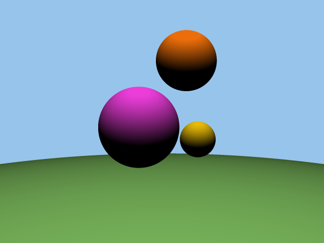
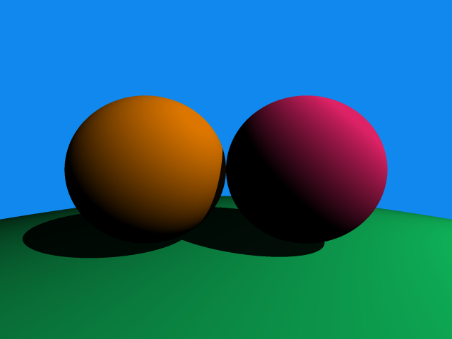

[](https://classroom.github.com/a/xVYZ_Q_r)
# Assignment - Dynamic Allocation, File I/O, Low Level Programming, Strings, qSort

## Ray Tracing
Having established the theoretical foundations for the gameplay of your new game, your studio informs you they have failed to hire any graphics programmers. Only a minor setback, as you have now been relocated to lead the graphics division. You want to make this a truly next-gen game, so it will be entirely ray traced. Unsatisfied with every game engine and rendering tool on the market, you decide to make your own in standard C to fully customize it for your needs. 


## Table of Contents

- [**Assignment Overview**](#overview) (**READ THIS FIRST!!**)

- [**Milestone Task Breakdown**](#milestone-task-breakdown)
    - [General Details Regarding the Milestone Format](#general-details-regarding-the-milestone-format)
    - [Milestone 1](#milestone-1-due-sunday-nov-10-at-2359)
    - [Milestone 2](#milestone-2-due-sunday-dec-1-at-2359)
    - [Final Submission](#final-submission-due-sunday-dec-8-at-2359)

- [**Implementation and Theory**](#implementation-and-theory)
    - [What you've given from input](#what-youre-given-from-input)
    - [Multi-File Structuve](#multi-file-structure)
    - [Makefile](#makefile)
    - [Vectors in 3 Dimensions](#vectors-in-3-dimensions)
    - [Rays](#rays)
    - [The Camera and Viewport](#the-camera-and-viewport)
    - [Representing RGB Colors Using 3D Vectors](#representing-rgb-colors-using-3d-vectors)
    - [Light and Background Color](#light-and-background-color)
    - [Spheres and the World](#spheres-and-the-world)
    - [Checking for Sphere Intersection](#checking-for-sphere-intersection)
    - [Conversion Between HEX and RGB Color Formats](#conversion-between-hex-and-rgb-color-formats)
    - [Assigning Colors](#assigning-colors)
    - [Lighting and Calculating Color](#lighting-and-calculating-color)
    - [Using PPM Files to Render Images](#using-ppm-files-to-render-images)
    - [The Rendering Pipeline](#the-rendering-pipeline)
    - [Anti-Aliasing](#anti-aliasing)

- [**Input and Output**](#input-and-output-specifications-and-examples)
    - [Input](#input)
    - [Output](#output)
        - [Milestone 1 Output](#milestone-1-output)
        - [Milestone 1 Example I/O](#milestone-1-example-io)
        - [Milestone 2 Output](#milestone-2-output)
        - [Milestone 2 Example I/O](#milestone-2-example-io)
        - [Final Submission Output](#final-submission-output)
        - [Final Submission Example I/O](#final-submission-example-io)

- [**Checking**](#checking)

- [**Marking Scheme**](#marking-scheme)

## Overview

In this assignment, you will be creating a 3D renderer from scratch. The final version of your program will output an image of spheres in 3D space, rendered using semi-realistic lighting and ray tracing techniques. This may seem daunting at first, but this is very possible to do using what you've learned, what you will learn, and a little extra math.

---

This description consists of three sections: [Milestone task breakdown](#milestone-task-breakdown), [implementation and theory](#implementation-and-theory), and [input/output specifications and examples](#input-and-output-specifications-and-examples). The purpose of each section is described below:

1. [**Milestone Task Breakdown**](#milestone-task-breakdown): For submission timeline purposes, this assignment is broken down into two milestones (and a final submission). You should have a working part of the assignment done for each milestone. This is for you to properly test your program at different stages. The milestone section in this description is to provide you with the specifics regarding which tasks should be completed by each milestone's deadline.

2. [**Implementation and Theory**](#implementation-and-theory): Here we describe the way the program functions conceptually, as well as implementation requirements. This section does not necessarily describe each task in the order that they should be implemented in (that is what the milestones section is for). We recommend to make sure you understand how the overall program functions before starting with any implementation.

3. [**Input and Output Specifications and Examples**](#input-and-output-specifications-and-examples): As always, we will provide you with the specifics regarding the input format and what's expected from you in terms of output for each milestone/final submission. Finally, for each milestone/final submission, example I/O is provided as well.

---

The suggested workflow is:
1. Find the milestone you plan to work on in the [milestone breakdown section](#milestone-task-breakdown).
2. Find the task you plan to work on.
3. Complete the task by referring to the implementation/theory section corresponding to the task.
4. Do this for each task in the milestone, testing your code as you go along.
5. Once you complete every task, you can check your progress by looking at the [I/O examples](#output), and by running [the appropriate check script](#checking).

Fair warning: this assignment is long and challenging. **There is a reason you get half the semester to do it.** The milestones are there to encourage people to get started early. If you are struggling, make sure to attend lab sections and office hours to ask for help. Good luck!

# Milestone Task Breakdown

This section outlines what you should be working on and should complete for each milestone. For implementation details and explanations, refer to the [implementation section](#implementation-and-theory).

This section is designed as follows: each milestone section below will contain what needs to be completed by the due date of that milestone. Once you know what you have to work on next, refer to the [implementation section](#implementation-and-theory) of that respective task/concept, there you will find the explanations for the concepts, as well as the implementation details.

## General Details Regarding the Milestone Format
- You will be provided with a check script for each milestone and the final submission for you to verify your progress ([more details on check](#checking)).
- Milestone 1 and 2 are each graded out of $10$ points, and weigh $2\%$ of your final grade. The final submission is worth $13\%$ of your final grade ([more details on the marking scheme](#marking-scheme)).
- While there are $3$ sections for this assignment, it should be **one overall program** (not one file, not three programs, one multi-file program).
- Your program should give different output based on the milestone/final submission, this is determined using a preprocessor macro that your program will be compiled with. Your program will be tested using different input and output according to each Milestone/final submission ([more details on output](#output)).
- Each student will have to demo at least one milestone.
- Both Milestones have a three week period available to be completed. There is one week between the due date of Milestone 2 and the due date of the final submission.

## Before You Start

1. Familiarize yourself with [what you're given from input](#what-youre-given-from-input) which is a brief introduction of the input (this section is different than the [input specifications section](#input) which is in thorough detail).
2. Familiarize yourself with the [multi-file structure of this assignment](#multi-file-structure).
3. Consider creating a [Makefile](#makefile) for a smooth workflow.

## Milestone 1 (Due Sunday Nov. 10 at 23:59)
**Milestone 1 will always be compiled using the preprocessor macro `MS1`**

1. Create `assg.c` (and optionally `assg.h`). This is where the main function should be.
2. `vector.h` provides many function prototypes, implement these functions in a new file `vector.c` ([vector library details](#vectors-in-3-dimensions)).
3. Create representations for viewport and camera ([viewport and camera details](#the-camera-and-viewport)).
4. Create representations for light and background color ([light and background color details](#light-and-background-color)).
5. `spheres.h` provides function prototypes used by the world data type, implement them in a new file `spheres.c` (no need to implement `doesIntersect` for Milestone 1) ([world data type details](#spheres-and-the-world)).
6. Read input and store the provided information in the previously created representations ([input details](#input-and-output-specifications-and-examples), [color representation details](#representing-rgb-colors-using-3d-vectors)).
7. Give output according to [the Milestone 1 output specifications](#milestone-1-output).

**Mandatory files for Milestone 1:** `src/assg.c`, `src/vector.c`, `src/spheres.c`.

**Important**:
When reading input and storing values, **exclude any color** for Milestone 1. In the input file, colors will be given in HEX (`0x######` where each `#` is a hexadecimal digit). Convering HEX to RGB will be implemented after Milestone 2. Instead, **you must** use the default colors given here:
1. The default color for spheres is white (`rgb(255, 255, 255)`).
2. The default background color is black (`rgb(0, 0, 0)`).

**We strongly recommend to start writing your [Makefile](#makefile) by this point because of the program's size.**

See: [Milestone 1 Example I/O](#milestone-1-example-io)

## Milestone 2 (Due Sunday Dec. 1 at 23:59)
**Milestone 2 will always be compiled using the preprocessor macro `MS2`**

1. Implement the function that checks for sphere intersection ([sphere intersection details](#checking-for-sphere-intersection)).
2. Implement the rendering pipeline using everything implemented thus far ([rendering pipeline details](#the-rendering-pipeline)).
3. `color.h` provides a function prototype for a function used to write a color to a PPM file, implement this function in `color.c` ([PPM details](#using-ppm-files-to-render-images)).
4. Write output to the PPM file given in the input ([input details](#input-and-output-specifications-and-examples)) according [the Milestone 2 output specification](#milestone-2-output).

**Mandatory files for Milestone 2:** `src/assg.c`, `src/vector.c`, `src/spheres.c`, `src/color.c`.

See: [Milestone 2 Example I/O](#milestone-2-example-io)

## Final submission (Due Sunday Dec. 8 at 23:59)
**The Final Submission will always be compiled using the preprocessor macro `FS`**

1. Complete `Makefile`, which should compile all three parts of the assignment with the appropriate preprocessor macros. ([Makefile details](#makefile)).
2. `color.h` provides a function prototype for a function that converts from HEX to RGB, implement this function in `color.h` ([HEX and RGB details](#conversion-between-hex-and-rgb-color-formats)).
3. Implement color sorting to assign each sphere its correct color ([details about assigning colors](#assigning-colors)).
4. Update the code that reads input and builds the world so that it uses the new HEX to RGB function to store the proper colors for the background and each sphere ([input details](#input-and-output-specifications-and-examples), [HEX and RGB details](#conversion-between-hex-and-rgb-color-formats)).
5. Implement anti-aliasing into the rendering pipeline ([anti-aliasing details](#anti-aliasing)).

**Mandatory files for the Final Submission:** `src/assg.c`, `src/vector.c`, `src/spheres.c`, `src/color.c`, `Makefile`.

See: [Final Submission Example I/O](#final-submission-example-io)

# Implementation and Theory
This section explains both the math, and the implementation concepts needed to complete the assignment. We will of course not give you all the specifics since we want you to implement the grand majority of the program yourself.

Use this as a guide for the concepts needed for you to complete the assignment. **Do not use this section for order of implementation**, for that please refer to the Milestone breakdown section before this one. Once familiar with the concepts and process, your task is then to translate that into C code as specified.

## What you're given from input
First, we briefly introduce what is given as input, this will make the implementation easier to explain since you will know what will be given in advance. Both milestones and the final submission use the same input format. For thorough details on input, please refer to the [input specification section](#input).

You are given:
1. Image width and height.
2. Viewport height.
3. Camera focal length.
4. Light position and brightness.
5. The number of colors in the world.
6. A list of colors in HEX.
7. Background color index.
8. The number of spheres in the world.
9. Position, radius, and color index of multiple spheres.

Don't worry if you don't understand all of this, it will be explained in a moment.

## Multi-File Structure

This assignment is large, and so multiple files will be used for organization. This is what the source directory `src` will look like:

```
src/
|-- [assg.h]
|-- <assg.c>
|-- vector.h
|-- <vector.c>
|-- spheres.h
|-- <spheres.c>
|-- color.h
`-- <color.c>
```

- Files enclosed in `[]` **are not provided** and **are optional** to include in the final submission.
- Files enclosed in `<>` **are not provided** and **are mandatory** to include in the final submission. These are files that you must create and implement.
- All other files **are provided** and **are mandatory** to include in the final submission. These files contain function prototypes that are given to you and **must not be changed**. You may however, implement your own functions for which you may declare the prototypes in these files.

**Important:** Refer to the [milestone task breakdown section](#milestone-task-breakdown) for details about which files are expected from you for each milestone/final submission.

**Important:** The main function goes in `assg.c`.

**Note:** Make sure to include the corresponding header file when implementing the functions. For example in `vector.c` you should include `vector.h` using `#include "vector.h"`.

## Makefile

For the final submission of the assignment, you are required to submit a Makefile (named `Makefile` in the root directory). This Makefile should be able to compile all three parts of the assignment with each of their appropriate preprocessor macros defined (i.e. Milestone 1 executable should be compiled with the macro `MS1` defined, Milestone 2 with `MS2`, etc).

**When running `make`, your Makefile should do the following:**
1. Create three executable files, one for each section of the assignment. These executable files
    - Should be named `MS1_assg`, `MS2_assg`, and `FS_assg` corresponding to the assignment sections Milestone 1, Milestone 2, and Final Submission respectively.
    - Should all be located in the root directory.
    - Should be created by compiling your code defining the `MS1`, `MS2`, or `FS` preprocessor macro depending on to the assignment section.
    - When ran with the appropriate [input](#input), should produce the [output](#output) corresponding to its assignment section.
2. Delete all intermediate object files.

**Important: `FS_check.sh` and our making scripts will use your Makefile to compile your final submission, so make sure it functions as intended.**

We recommend you to begin writing your Makefile as soon as you learn how to. It will make your workflow much smoother since otherwise you will have to link and compile many object files every time you want to test your program.

## Vectors in 3 Dimensions
A 3D vector is a way to represent direction and magnitude in 3D space. A vector can denote a point in space, a direction, or many other things. In this assignment, they will be used to describe direction and position of objects in our world. A 3D vector can be represented using 3 real numbers, and they are represented using an arrow and written as

$$\vec{v}=(a,b,c)$$

Where $a,b,c$ are real numbers. Since we're using vectors to represent positions and directions, we can think of $a$ corresponding to the $x$ axis, $b$ to the $y$ axis, and $c$ to the $z$ axis.

In C, structs make it very easy for us to implement a 3D vector type:

```C
typedef struct {
    float x;
    float y;
    float z;
} Vec3;
```

For this assignment, you are tasked with implementing functions that will perform operations on the `Vec3` type defined above. The prototypes for these functions, as well as the type definition above, are given in a file `vector.h` in the source directory `src`. Create a `vector.c` file to implement these functions. Make sure to include `vector.h` at the top of `vector.c` as `#include "vector.h"`.

The following function prototypes are given to you in `vector.h` and are for you to implement in `vector.c`. **Do not** change anything in the header file `vector.h`.

```C
Vec3 add(Vec3 v1, Vec3 v2);
Vec3 subtract(Vec3 v1, Vec3 v2);
Vec3 scalarMultiply(float s, Vec3 v);
Vec3 scalarDivide(Vec3 v, float d);
Vec3 normalize(Vec3 v);
float dot(Vec3 v1, Vec3 v2);
float length2(Vec3 v);
float length(Vec3 v);
float distance2(Vec3 v1, Vec3 v2);
float distance(Vec3 v1, Vec3 v2);
```

The operations to be implemented are defined (mathematically) below: 

Let $\vec{v}=(v_1,v_2,v_3)$ and $\vec{u}=(u_1,u_2,u_3)$. Then the operations you will implement are defined as follows:
1. **Vector addition:**
   
   $$\vec{v}+\vec{u}=(v_1+u_1,v_2+u_2,v_3+u_3)$$

2. **Vector subtraction:**
 
   $$\vec{v}-\vec{u}=(v_1-u_1,v_2-u_2,v_3-u_3)$$
   
3. **Scalar Multiplication:**

   $$s\vec{v}=(sv_1,sv_2,sv_3)$$
   
4. **Scalar Division:**

   $$\frac{\vec{v}}{s}=\left(\frac{v_1}{s},\frac{v_2}{s},\frac{v_3}{s}\right)$$
   
5. **The Dot Product:**

    $$\vec{v}\cdot\vec{u}=v_1u_1+v_2u_2+v_3u_3$$

    This represents the cosine of the angle between the two vectors.
6. **The Length of a Vector:**

    $$\left|\vec{v}\right|=\sqrt{v_1^2+v_2^2+v_3^2}=\sqrt{\vec{v}\cdot\vec{v}}$$

    You are also tasked with implementing `length2` which should calculate length squared (this is sometimes useful since it skips the square root calculation, which can be very slow).
7. **Distance Between 2 Vectors:**

    $$\text{dist}(\vec{v},\vec{u})=\left|\vec{v}-\vec{u}\right|$$

    You are also tasked with implementing `distance2` which should calculate distance squared.
8. **Normalization of a Vector:**

    $$\text{norm}\;\vec{v}=\frac{\vec{v}}{\left|\vec{v}\right|}$$

    This represents a new vector that is in the same direction as $\vec{v}$, but has length equal to $1$.

NOTE: As you can see, you will need to use a square root function. You must include `math.h` to make use of the `sqrt` function. Make sure to link your program using `-lm`. More details can be found in the compiling and linking section below.

## Rays
You may have heard of the term "ray tracing" when talking about computer graphics. Well, you will be implementing it in this assignment (to some extent). You will be casting rays from the camera into the world, and if the ray hits anything, an additional ray is casted to check for shadows. However, there will be no additional reflection or refraction rays.

A ray is simply a line in 3D space that we represent using two 3D vectors, a _position vector_ $\vec{p}$, and a _direction vector_ $\vec{d}$. The position vector describes any point on the line. The direction vector describes the direction in which the line (ray) extends into. We can write any line as a function using these two vectors:

$$R(t)=\vec{p} + t\vec{d}$$

where $t$ is any scalar. One can see that inputting different values $t$ into the $R$ yields different points on the line. In fact, _any_ point on the line can be given by $R(t)$ for some real number $t$.


Using our implementation of vectors, we can easily represent a ray in C using either structs, or just two vectors.

---

**Implementation:** To represent a ray, you must use the `Vec3` type defined in `vector.h` for the direction and position vector (each ray will be two `Vec3` variables).

With the help of a camera and a viewport, we will create rays, shooting them from the camera's position, into each pixel of the image. From each ray, a color is calculated, and a final image is produced.

## The Camera and Viewport

The purpose of rays is to check if they intersect with anything in our world. Each ray corresponds to exactly one pixel (for now). After a ray intersects with any geometry, the color is calculated and the pixel is colored accordingly. In order to cast rays through each pixel of our image, we need to map the dimensions of our 2D image, into a 2D viewport in the 3D world.


The viewport is simply a rectangle in front of the camera. All rays are shot from the camera (a single point) in the direction of, and through the viewport. Its purpose is to determine the image's field of view, scale, viewing direction, etc.

---

**Implementation of the camera and viewport:**
- The position of the camera should always be $(0,0,0)$.
- The viewport height is given through input.
- The viewport width is calculated to match the image aspect ratio.
- The distance from the camera to the middle of the viewport is the _focal length_, which is given through input.
- The camera should always point towards the negative $z$ axis. Meaning the viewport's $z$ value should be `-focalLength`. This means the viewport is always parallel to the $x$ and $y$ axes.

Notice how the dimensions of the viewport **are not** the same as the image's. We call these two coordinate systems the _world space_, vs the _image space_. To calculate the point in the viewport each pixel is shot through, each pixel's image coordinates need to be scaled to match their respective world coordinates.

---

**How can I shoot rays using the camera and viewport?**

**The viewport is the rectangle where the world is projected onto.** It is divided into many pixels where one ray is shot through each. The ray then tells its pixel if there is any geometry in that direction and what color it should be. The final result is an image of the 3D world.


To produce a ray, we must calculate a position vector and a direction vector.
- The position vector will always be the camera's position (which is $(0,0,0)$).
- The direction vector will go from the camera to the centre of one pixel (HINT: Subtracting two vectors $\vec{v} - \vec{u}$ results in a new vector that goes from $\vec{u}$ to $\vec{v}$).

Make sure that the ray goes **through the centre of the pixel** (as seen in the graphic above). The pixel position coordinates correspond to the corner of the pixel, **not** the centre.

**Important:** Make sure your representation of the camera and viewport can be accessed throughout `assg.c`. They should be global variables.

## Representing RGB Colors Using 3D Vectors

Programmers and artists like to work with the RGB color format. The format is represented as three numbers, respectively being the amount of **R**ed, **G**reen, and **B**lue.

You may be familiar with representing RGB values on a range from $[0,255]$, however since our `Vec3` implementation uses `float`, you will be representing RGB on the range $[0,1]$.

So, red will be `(1.0, 0.0, 0.0)`, white `(1.0, 1.0, 1.0)`, black `(0.0, 0.0, 0.0)` etc.

## Light and Background Color

In this assignment, there will only be one light source. This light source is a single point in space where all light comes from. The light's position will determine the shading applied on each surface. Furthermore, the background color is not affected by light and is always the same: this should be represented the same way all color is represented: `Vec3` RGB in the range $[0,1]$.

---

**The light source has two attributes:**
- Position
- Brightness

The background color, the light's position and brightness are all provided through [input](#input-and-output-specifications-and-examples).

Refer to [Assigning Colors](#assigning-colors) for determining the background color in HEX, and [Conversion Between HEX and RGB Color Formats](#conversion-between-hex-and-rgb-color-formats) to decode the RGB color.

**Important:** Make sure your representation of the light and background color can be accessed throughout `assg.c`. They should be global variables.

## Spheres and the World

As you know, the image you will be generating will consist of spheres alone. Each sphere in this assignment will have 3 attributes: the position for its centre, its radius, and its color. Given to you in the header file `spheres.h` is the following type definition

```C
typedef struct {
    float r;
    Vec3 pos;
    Vec3 color;
} Sphere;
```

**The vector data type (different from `Vec3`):**
- The vector data type is a dynamic array that keeps track of the amount of memory allocated, and the size. It allows for easy and efficient insertion. Initially, the vector begins with a capacity of one and size zero. It also doubles its capacity once the size surpasses the old capacity.

In `spheres.h`, you will be implementing a dynamic array for these spheres. This way you can easily manage all spheres dynamically. This will be implemented using the vector data type (again, this is different that `Vec3`). The following type definition is given:

```C
typedef struct {
    Sphere **spheres;
    int size;
    int capacity;
} World;
```

`spheres` is the array of sphere pointers, `size` is the number of spheres in the array, and `capacity` is the number of spheres able to be stored by the array determined by the allocation size of it.

The following four function prototypes are given in `spheres.h` for you to implement in `spheres.c`:

```C
void worldInit(World *world);
void freeWorld(World *world);
void addSphere(World *world, Sphere *sphere);
Sphere *createSphere(float radius, Vec3 position, Vec3 color);
```

Implement these functions appropriately in order to manage memory and all the spheres according to the vector data type.

Additionally, `addSphere` should append the given `sphere` pointer to the end of `World.spheres`.

**Important:** Make sure that you are managing memory correctly when implementing dynamic arrays. Details on how leaking memory will impact your grade are found in the [marking scheme section](#marking-scheme).

## Checking for Sphere Intersection

This is a crucial step in the assignment. Knowing if a ray intersects is how you determine the color that will be outputted. Any errors here may result in: spheres behind the camera being rendered, nothing being rendered, light direction being wrong, etc.

This is a long section as it is math intensive and we want to explain things thoroughly and provide implementation details.

You will be implementing the following function in `spheres.c`, where the prototype is provided to you in `spheres.h`:

```C
int doesIntersect(const Sphere *sphere, Vec3 rayPos, Vec3 rayDir, float *t);
```

This function should check if `sphere` intersects with the ray `rayPos + t*rayDir`. If there is an intersection then it should provide the value of `t` through the pointer `float *t` and return `1`. This can then be used to calculate the intersection point and normal vector. If there is no intersection then it should return `0`.

### The Math

As we know, a ray (line) starting at a point $\vec{p}$, going in direction $\vec{d}$ can be written as

$$R(t)=\vec p+t\vec d, t\in\mathbb{R}$$

A sphere with centre position $\vec{c}$ and radius $r$ can be written as

$$\left|\vec x-\vec c\right|^{2}=r^{2}$$

where $\vec x$ is a point on the surface of the sphere. This can be rewritten using the dot product

$$(\vec x-\vec c)\cdot(\vec x-\vec c)=r^{2}$$

To see if a ray $R(t)$ intersects the sphere, we can replace $\vec x$ with $R(t)$

$$(R(t)-\vec c)\cdot(R(t)-\vec c)=r^{2}$$

The ray function can be replaced with its parametric equation defined above

$$(\vec p+t\vec d-\vec c)\cdot(\vec p+t\vec d-\vec c)=r^{2}$$

this can be manipulated into a quadratic equation with variable $t$

$$t^2(\vec d\cdot \vec d)+2t\vec d\cdot(\vec p-\vec c)+(\vec p-\vec c)\cdot(\vec p-\vec c)-r^{2}=0$$

Obtaining the discriminant of this quadratic equation tells us how many intersections there are with the sphere

$$\text{discriminant}=b^2-4ac\quad\implies\quad\text{discriminant}\begin{cases}<0 & \text{No intersections (2 complex roots)} \newline =0 & \text{One intersection} \newline >0 & \text{Two intersections (2 real roots)}\end{cases}$$

If there are any intersections, the quadratic can be solved using the quadratic formula

$$t=\frac{-b\pm\sqrt{b^{2}-4ac}}{2a}$$

Then if there are any intersections, the intersection point will be at

$$\vec p+t\vec d$$

### Pseudocode Overview

Here we provide pseudocode outlining the process of implementing this function.

This is not code you should copy and paste directly as it is missing parts and uses overloaded operators for vectors which you do not have access to. Use this to guide you through implementing the calculation of sphere intersection in your assignment, filling in any missing sections.

```C
Vec3 rayPos; // Ray position
Vec3 rayDir; // Line direction
Vec3 spherePos; // Sphere centre
float sphereRadius; // Sphere radius

// Get a, b, c for the quadratic formula
Vec3 V = rayPos - spherePos;
float a = dot(rayDir, rayDir);
float b = 2*dot(rayDir, V);
float c = dot(V, V) - sphereRadius*sphereRadius;
float discriminant = calculateDiscriminant(a, b, c);

// Check the discriminant.
// This will tell us if there are any intersections.
if (discriminant <  0); // Does not intersect (complex roots)
if (discriminant >= 0); // Does intersect (real root(s))

// Solve for t using the quadratic formula
float t1, t2;
solveQuadratic(a, b, c, &t1, &t2);
// t1 and t2 are the factors for which rayDir is scaled
//   to yield an intersection point.

if (t1 < 0); // First intersection is behind
if (t2 < 0); // Second intersection is behind

if (t1 > 0); // First intersection is in front
if (t2 > 0); // Second intersection is in front

// The solution must be positive, we dont want to render
//   anything that is behind the camera.
// If ray intersects the spheres in two
//   positions (entering and exiting the sphere)
//   then we only care about the one entering
//   the sphere (the lower one).
float t = /* Choose t1 or t2 if there is an intersection */;

// We can finally find our intersection and normal
Vec3 intersectionPoint = rayPos + t*rayDir;
Vec3 normal = intersectionPoint - spherePos;
// NOTE: the normal vector is called normal but it
//   does not need to be normalized.

// Calculate a colour based on these two vectors
```

Just like `vector.c`, you may need to use `sqrt` in `spheres.c` in order to implement `doesIntersect`. Again, make sure you include `math.h` and link your program using `-lm`. More details in the compiling and linking section below.

## Conversion Between HEX and RGB Color Formats

Provided to you is the header file `color.h`. Since the input will provide color not in RGB in the range $[0,1]$, but in HEX, you will have to convert from HEX to RGB.

The HEX format is simply the RGB format on the range $[0,255]$, where each of the three values is in hexadecimal, and represented as a single string. For example, all the following represent the same color in different formats:

| Color Format  | Value             |
| ------------- | ----------------- |
| HEX           | `0x00FF33`        |
| RGB $[0,255]$ | `[0, 255, 51]`    |
| RGB $[0,1]$   | `[0.0, 1.0, 0.2]` |

When reading any color from the input file, it will be in HEX (will always be in the format `0x######` where `#` is a hexadecimal digit). You have to store it in `unsigned int`; this is because you will have to unpack this value and convert it into RGB $[0,1]$ using `Vec3`.

Using the exmple above, `0x00FF33`, which looks like `00000000 11111111 00110011` in binary, should be converted to a `Vec3` in the form `[0.0, 1.0, 0.2]`.

Given to you in `color.h`, is the following function prototype that should be implemented by you in `color.c`. This function should convert from HEX to RGB $[0,1]$ and return it. Implement it using the process described above.

```C
Vec3 unpackRGB(unsigned int packedRGB);
```

## Assigning Colors

There is one additional complication. You are provided with the *color index* each sphere and the background should be, and a list of colors in random order. 

You need to:
1. Read the list of colors in HEX (you are provided with the number of colors, and a list of colors, see [input specifications](#input)).
2. Sort the list of colors using `qsort` according to the following comparison function. You may simply copy and paste this function into your `color.c` file.

```C
int compareColor(const void *a, const void *b)
{
    int a1 = 0, b1 = 0;
    for (int i = 0; i < sizeof(int); i++)
    {
        a1 |= (*((unsigned char*)a + i) & 0x0F) << (i * 8);
        b1 |= (*((unsigned char*)b + i) & 0x0F) << (i * 8);
    }
    
    return (a1 < b1) ? -1 : (b1 < a1) ? 1 : (*((int*)a) < *((int*)b)) ? -1 : (*((int*)a) > *((int*)b)) ? 1 : 0;
}
```

3. Each sphere has a color index. This index corresponds to the *sorted* list, so a sphere color of index $0$ will be the HEX color at index $0$ of the list, and so on.
4. The background color also has an index, as it is simply one of the availiable colors.

Note that several spheres may have the same color index, and one or more spheres may be the same color as the background. However, you will not encounter duplicate colors in the list.

## Lighting and Calculating Color

After calculating intersection, the program has everything it needs to know to calculate a final pixel color and where to write it to. All the things the program needs to know are:
- $(x,y):$ Pixel to write to.
- $\vec{S}:$ Color of the sphere.
- $\vec{l}:$ Light position.
- $b:$ Light brightness.
- $\vec{p}:$ Intersection point.
- $\vec{n}:$ Surface normal.

The final color in RGB, given by $P(x,y)$ should be calculated as follows:

$$
P(x,y)=I\vec{S}
$$

Where $I$ is the intensity of the light. It makes sense for this intensity to decrease gradually as it's distance to the intersection point increases. This is why the intensity is calculated as

$$
I=\min(1,I_{0})\qquad\text{ where }\qquad I_{0}=b\times\frac{\max(\vec{d}\cdot\vec{n},0)}{\text{dist}(\vec{l},\vec{p})^{2}}
$$

Where $\vec{d}$ is the **normalized** light direction from the intersection point (going out of the intersection point, not into) (**HINT:** `subtract` and `normalize` functions should prove useful when calculating $\vec{d}$).

We clamp the dot product between $\vec{d}$ and $\vec{n}$ to be $\ge0$ in order to prevent a negative intensity value.

NOTE: It is very important to cap the intensity at $1$.


## Casting Shadows onto Surfaces

Once an intersection is found by a ray, there is a possibility that there is another sphere is blocking the light. This would result in a shadow.

Simulating this can be done using what has been implemented so far.

---

**Implementation:**

Once a ray intersects with a sphere and the lighting is calculated at that point (details in the [lighting section](#lighting-and-calculating-color)), call this color value `surfaceLightingColor`, checking for a shadow should be done in this way:
1. Cast a ray from the intersection point in the direction of the light.
2. Check if that ray intersects with anything.
    - If it does, then scale `surfaceLightingColor` down by a factor `shadowFactor`, this will make the surface appear darker.
    - If not then there is no shadow here and `surfaceLightingColor` is the final pixel color.

**`shadowFactor` is always equal to `0.1`**

---

**Important:** When casting a ray to check for shadows, make sure that the ray's position vector is not equal to the intersection point exactly. It should be slightly moved in front (this is to avoid floating point precision causing the ray to begin inside the sphere).

This can easily be fixed by moving the intersection point slightly in the surface normal vector's direction.

If $\vec{i}$ is the intersection point and $\vec{n}$ is the surface normal at that point, then the ray that checks for shadows' position vector $\vec{p}$ should be calculated as

$$\vec{p}=\vec{i}+0.001\vec{n}$$

Not doing this will result in very small visual errors such as small black spots on spheres.

---

Below is the difference between **casting shadows**, and **not casting shadows**:




## Using PPM Files to Render Images

After calculating a color for a pixel, you will have to write it to a PPM file (just like lab 3). You can learn more about this format [here](https://netpbm.sourceforge.net/doc/ppm.html), or read the below section for the relevant information.

Here is an example Portable Pixel Map (PPM) image:

```
P3
3 2
255
255 0 0 0 255 0 0 0 255
255 255 255 0 0 0 120 120 120
```

The first 3 lines is the header and should always be the following:
- `P3` specifies that this PPM file is in ASCII.
- `3 2` are the image width and image height. Change these accordingly to your image.
- `255` specifies the maximum value for intensity. Since we will be using the RGB colour format, 255 is what you should use. This means that white is represented as `255 255 255`, red is `255 0 0`, black is `0 0 0`, etc.

The lines after the header represent pixels:
- Each pixel consists of 3 integers from 0 to 255, representing the R, G, B values
- Each pixel is sequentially written from left to right then top to bottom according to the image width and height specified in the header.
- Each integer value can be separated with any whitespace. The extra spaces and newlines in the example were added for visual clarity

This results in the image:


---

Provided to you in `color.h` is the following function prototype

```C
void writeColour(FILE *ppmFile, Vec3 color);
```

This function should be implemented by you in `color.h`, and should write the given color to `ppmFile` in accordance to the appropriate PPM format.

**TIP:** Writing to the image in order from (in image coordinates) `0,0`, to `imgW-1,imgH-1` will result in an upside down image. This is because the first pixel written to a PPM file is always the top left corner of the image. **Make sure your image is not upside down**.

### Viewing PPM Images

You are provided with a program named `viewppm`. This program will take a path to a PPM file as an argument, and display the image on the terminal, including colors. An example on how to use this is `./viewppm FS_Testcases/12_output.ppm`. This will display a very low quality version of the image.

**MAC USERS:** The default terminal in Mac does not support 24-bit colors and so the colors of the output of `viewppm` are slightly off.

`viewppm` is meant to be used to quickly test your program and to make sure that your PPM files are formatted correctly.

To view the image at its full resolution, you have some other options: [This website](https://www.cs.rhodes.edu/welshc/COMP141_F16/ppmReader.html), or if you use Visual Studio Code you can use [this extension](https://marketplace.visualstudio.com/items?itemName=ngtystr.ppm-pgm-viewer-for-vscode) to view them directly in the IDE. Make sure that the file extension is `.ppm`.

### Comparing Images

There is a lot of room for error in this assignment, and since the output is so large we will accept solutions _slightly_ off.

You are provided with a python file named `ppmcmp.py`.

This program requires two positional arguments:
1. PPM image path 1
2. PPM image path 2

The output of this program is a real number in the range $[0,255\sqrt{3}]$. This value represents the average Cartesian distance between each pixel of images 1 and 2 after applying a Gaussian Blur. Basically, the larger the output of this program, the less similar both images are.

Example usage: `python3 ppmcmp.py MS2_Testcases/11_output.ppm MS2_Testcases/11_student.ppm`

An output of $0$ signifies that both images are identical, while an output of $255\sqrt{3}=441.67$, the maximum possible value, occurs when one image is completely white, and the other completely black.

**Your solution is considered passable if the output of `ppmcmp.py` is $\le5$**. Note that if your image barely passes on one example, there may be drastically different results on other examples depending on your mistake, so please test your program thoroughly.

## The Rendering Pipeline

The rendering pipeline is a procedure that runs for each pixel and results in a final color. It will use everything implemented so far so make sure that it is all working correctly.

For each pixel, the rendering pipeline should perform the following tasks (in order):
1. Create a ray (multiple rays when implementing [anti-aliasing](#anti-aliasing)) ([camera and viewport section](#the-camera-and-viewport)).
2. Check for any sphere intersections with that ray ([sphere intersection section](#checking-for-sphere-intersection)).
    - If there are no intersections, then the final color is the background color and the procedure is done.
3. If the ray hits a sphere, then calculate the surface color at that point affected by lighting ([lighting section](#lighting-and-calculating-color)).
    - **IMPORTANT:** Make sure the rendered sphere for each ray is the closest intersecting sphere.
4. If there is any surface between the intersection point and [the light](#light-and-background-color), then a shadow is being cast onto this surface. If this is the case, then darken it accordingly ([shadow casting section](#casting-shadows-onto-surfaces)).
5. The color calculated in step 3 or step 4 is the final color. The procedure is done.

As seen above, there are 3 possibilities for the final color: a lit surface, a shaded surface, or the background color.

After calculating a pixel's final color, it should be written to an image using [the PPM format](#using-ppm-files-to-render-images).

## Anti-Aliasing

Anti-aliasing is a tecnique used in graphics programming to smooth out jagged edges. You may have noticed these jagged edges by this point. Below is an example of the difference between a regular render, and a render using anti-aliasing:


There are many ways to produce this effect, for this assignment, you will be implementing grid sampling anti-aliasing. This is done by calculating the final color of each pixel multiple times, in different places, then averaging the result.

In this assignment **you must sample each pixel 9 times**. The places where you must sample each pixel are in the centre of each cell if the pixel was divided into a 3x3 grid. See the diagram below


The final pixel color is the average all these samples. The average of an RGB color represented as a `Vec3` can be calculated using vector addition and scalar division.

Note that an entire process of color calculation is done _for each pixel sample_. Yes, adding this feature will make your program run nearly $9$ times slower than before. This is why it is the last feature to implement.

# Input and Output Specifications and Examples

## Input

The **input is the same for all milestones/final submission** and is given in two ways:

Firstly, your program will be given two commandline arguments: `<input file path (char)> <output file path (char)>`. The first argument is the path of the input file which contains all the information needed to build the world. The second argument is the path of the file to which your program should output (this will be a `txt` file for Milestone 1, and a `ppm` file for Milestone 2 and the Final Submission).

Secondly, the information needed to build the world is given in the input file specified in the first commandline argument. The input file will have the following structure:

```
<image width (int)> <image height (int)>
<viewport height (float)>
<focal length (float)>
<light position (3float)> <light brightness (float)>
<number of colors `m` (int)>
<color 1 (HEX)> <color 2 (HEX)> ... <color m (HEX)>
<background color index (int)>
<number of spheres `n` (int)>
<sphere 1 position (3float)> <sphere 1 radius (float)> <sphere 1 color index (int)>
<sphere 2 position (3float)> <sphere 2 radius (float)> <sphere 2 color index (int)>
...
<sphere n position (3float)> <sphere n radius (float)> <sphere n color index (int)>
```

Where:
- `int` is an integer value (will always be able to be stored using `int` in the lab machines).
- `float` is a floating point value (will always be able to be stored using `float` in the lab machines).
- `3float` are three consecutive `float`'s. Together they form a vector in 3 dimensions.
- `HEX` is a color given in the HEX format. This will always be in the format `0x######` where each `#` will be a hexadecimal digit.
    - Furthermore, you **must** store this value as an `unsigned int` since it will be used as an argument in a function expecting a value of this type.

The background and spheres color indices are used to determine their respective color off of the color list. This is explained in more detail in the [color assingment section](#assigning-colors) and the [light and background color section](#light-and-background-color).

**You may assume all input is valid.**

## Output

Your program should output different things based on which milestone/final submission is being tested.

Each milestone/final submission is compiled with a different preprocessor macro. Your program should output the corresponding output for each macro.

---

### Milestone 1 Output

**Milestone 1 will always be compiled using the preprocessor macro `MS1`. Your program should output the following only if `MS1` is defined.**

The output for milestone 1 will test the world you built off the given input, as well as your `vector.h` functions.

In this section, all `Vec3`s should be printed as `(x, y, z)` where `x, y, z` are formatted to one decimal place. Furthermore, all floating point values should also be formatted to one decimal place (`"%.1f"` is sufficient when formatting).

The first four lines will test `add`, `subtract`, `normalize`, and `scalarMultiply` from `vector.h` (in that order). The output should be as follows:

```
<background color (Vec3)> + <light position (Vec3)> = <result (Vec3)>
<background color (Vec3)> - <light position (Vec3)> = <result (Vec3)>
<viewport width (float)> * <light position (Vec3)> = <result (Vec3)>
normalize<light position (Vec3)> = <result (Vec3)>
```

The rest of the output will be repeated for each of the spheres (the order of the spheres should be in the same order as the input). Each sphere will have four lines testing `scalarDivide`, `dot`, `distance`, and `length` (in that order). The output should be as follows for each sphere:

```

<sphere color (Vec3)> / <sphere radius (float)> = <result (Vec3)>
dot(<light position (Vec3)>, <sphere position (Vec3)>) = <result (float)>
distance(<light position (Vec3)>, <sphere position (Vec3)>) = <result (float)>
length<sphere position (Vec3)> = <result (float)>
```

**NOTE:** Notice the newline character at the beginning of each sphere's output.


### Milestone 1 Example I/O

#### Example 1

Input:
```
640 480
2.0
1.0
20.0 20.0 10.0 1000.0
4
0x1188EE 0xDD2266 0xDD7700 0x11CC66
0
3
2.0 0.0 -5.0 2.0 2
-2.0 0.0 -5.0 2.0 3
0.0 -102.0 -5.0 100.0 1
```

Output:
```
(0.0, 0.0, 0.0) + (20.0, 20.0, 10.0) = (20.0, 20.0, 10.0)
(0.0, 0.0, 0.0) - (20.0, 20.0, 10.0) = (-20.0, -20.0, -10.0)
2.7 * (20.0, 20.0, 10.0) = (53.3, 53.3, 26.7)
normalize(20.0, 20.0, 10.0) = (0.7, 0.7, 0.3)

(1.0, 1.0, 1.0) / 2.0 = (0.5, 0.5, 0.5)
dot((20.0, 20.0, 10.0), (2.0, 0.0, -5.0)) = -10.0
distance((20.0, 20.0, 10.0), (2.0, 0.0, -5.0)) = 30.8
length(2.0, 0.0, -5.0) = 5.4

(1.0, 1.0, 1.0) / 2.0 = (0.5, 0.5, 0.5)
dot((20.0, 20.0, 10.0), (-2.0, 0.0, -5.0)) = -90.0
distance((20.0, 20.0, 10.0), (-2.0, 0.0, -5.0)) = 33.3
length(-2.0, 0.0, -5.0) = 5.4

(1.0, 1.0, 1.0) / 100.0 = (0.0, 0.0, 0.0)
dot((20.0, 20.0, 10.0), (0.0, -102.0, -5.0)) = -2090.0
distance((20.0, 20.0, 10.0), (0.0, -102.0, -5.0)) = 124.5
length(0.0, -102.0, -5.0) = 102.1
```

#### Example 2

Input:
```
640 480
2.0
5.0
0.0 20.0 0.0 500.0
5
0x97C4EB 0x88CC66 0xEB6E0A 0xEBBE0A 0xEB3EDA
0
4
0.0 -41.0 -18.0 40.0 1
0.4 1.0 -10.0 0.5 3
0.6 -0.3 -10.2 0.3 4
-0.4 -0.1 -10.5 0.7 2
```

Output:
```
(0.0, 0.0, 0.0) + (0.0, 20.0, 0.0) = (0.0, 20.0, 0.0)
(0.0, 0.0, 0.0) - (0.0, 20.0, 0.0) = (0.0, -20.0, 0.0)
2.7 * (0.0, 20.0, 0.0) = (0.0, 53.3, 0.0)
normalize(0.0, 20.0, 0.0) = (0.0, 1.0, 0.0)

(1.0, 1.0, 1.0) / 40.0 = (0.0, 0.0, 0.0)
dot((0.0, 20.0, 0.0), (0.0, -41.0, -18.0)) = -820.0
distance((0.0, 20.0, 0.0), (0.0, -41.0, -18.0)) = 63.6
length(0.0, -41.0, -18.0) = 44.8

(1.0, 1.0, 1.0) / 0.5 = (2.0, 2.0, 2.0)
dot((0.0, 20.0, 0.0), (0.4, 1.0, -10.0)) = 20.0
distance((0.0, 20.0, 0.0), (0.4, 1.0, -10.0)) = 21.5
length(0.4, 1.0, -10.0) = 10.1

(1.0, 1.0, 1.0) / 0.3 = (3.3, 3.3, 3.3)
dot((0.0, 20.0, 0.0), (0.6, -0.3, -10.2)) = -6.0
distance((0.0, 20.0, 0.0), (0.6, -0.3, -10.2)) = 22.7
length(0.6, -0.3, -10.2) = 10.2

(1.0, 1.0, 1.0) / 0.7 = (1.4, 1.4, 1.4)
dot((0.0, 20.0, 0.0), (-0.4, -0.1, -10.5)) = -2.0
distance((0.0, 20.0, 0.0), (-0.4, -0.1, -10.5)) = 22.7
length(-0.4, -0.1, -10.5) = 10.5
```

#### Example 3

Input:
```
640 480
2.0
5.0
-10.0 10.0 -30.0 500.0
5
0x6ABADA 0xFFFF00 0xFF4500 0x00FF00 0x0000FF
2
4
-6.0 0.0 -50.0 5.0 4
3.0 0.0 -55.0 3.0 3
10.0 0.0 -60.0 2.0 1
15.0 0.0 -65.0 1.0 0
```

Output:
```
(0.0, 0.0, 0.0) + (-10.0, 10.0, -30.0) = (-10.0, 10.0, -30.0)
(0.0, 0.0, 0.0) - (-10.0, 10.0, -30.0) = (10.0, -10.0, 30.0)
2.7 * (-10.0, 10.0, -30.0) = (-26.7, 26.7, -80.0)
normalize(-10.0, 10.0, -30.0) = (-0.3, 0.3, -0.9)

(1.0, 1.0, 1.0) / 5.0 = (0.2, 0.2, 0.2)
dot((-10.0, 10.0, -30.0), (-6.0, 0.0, -50.0)) = 1560.0
distance((-10.0, 10.0, -30.0), (-6.0, 0.0, -50.0)) = 22.7
length(-6.0, 0.0, -50.0) = 50.4

(1.0, 1.0, 1.0) / 3.0 = (0.3, 0.3, 0.3)
dot((-10.0, 10.0, -30.0), (3.0, 0.0, -55.0)) = 1620.0
distance((-10.0, 10.0, -30.0), (3.0, 0.0, -55.0)) = 29.9
length(3.0, 0.0, -55.0) = 55.1

(1.0, 1.0, 1.0) / 2.0 = (0.5, 0.5, 0.5)
dot((-10.0, 10.0, -30.0), (10.0, 0.0, -60.0)) = 1700.0
distance((-10.0, 10.0, -30.0), (10.0, 0.0, -60.0)) = 37.4
length(10.0, 0.0, -60.0) = 60.8

(1.0, 1.0, 1.0) / 1.0 = (1.0, 1.0, 1.0)
dot((-10.0, 10.0, -30.0), (15.0, 0.0, -65.0)) = 1800.0
distance((-10.0, 10.0, -30.0), (15.0, 0.0, -65.0)) = 44.2
length(15.0, 0.0, -65.0) = 66.7
```

All of these and more testcases may be found in `MS1_Testcases`.

---

### Milestone 2 Output

**Milestone 2 will always be compiled using the preprocessor macro `MS2`. Your program should output the following only if `MS2` is defined.**

The output of your program should be one image in the PPM format. Refer to [the section explaining PPM](#using-ppm-files-to-render-images) for details on how to implement this.

This image must be in grayscale. Where spheres are white and the background color is black. The spheres should be lit correctly.

See [milestone 2 examples](#milestone-2-examples) for example I/O.

### Milestone 2 Example I/O

#### Example 1

Input:
```
640 480
2.0
1.0
20.0 20.0 10.0 1000.0
4
0x1188EE 0xDD2266 0xDD7700 0x11CC66
0
3
2.0 0.0 -5.0 2.0 2
-2.0 0.0 -5.0 2.0 3
0.0 -102.0 -5.0 100.0 1
```

Output:


#### Example 2

Input:
```
640 480
2.0
5.0
0.0 20.0 0.0 500.0
5
0x97C4EB 0x88CC66 0xEB6E0A 0xEBBE0A 0xEB3EDA
0
4
0.0 -41.0 -18.0 40.0 1
0.4 1.0 -10.0 0.5 3
0.6 -0.3 -10.2 0.3 4
-0.4 -0.1 -10.5 0.7 2
```

Output:


#### Example 3

Input:
```
640 480
2.0
5.0
-10.0 10.0 -30.0 500.0
5
0x6ABADA 0xFFFF00 0xFF4500 0x00FF00 0x0000FF
2
4
-6.0 0.0 -50.0 5.0 4
3.0 0.0 -55.0 3.0 3
10.0 0.0 -60.0 2.0 1
15.0 0.0 -65.0 1.0 0
```

Output:


All of these and more testcases may be found in `MS2_Testcases`.

---

### Final Submission Output

**The Final Submission will always be compiled using the preprocessor macro `FS`. Your program should output the following only if `FS` is defined.**

Just like milestone 2, the output of your program should be one image in the PPM format. Refer to [the section explaining PPM](#using-ppm-files-to-render-images) for details on how to implement this.

The image must now be in full color according to the color specified in the input file. The image also must be rendered using anti-aliasing.

### Final Submission Example I/O

#### Example 1

Input:
```
640 480
2.0
1.0
20.0 20.0 10.0 1000.0
4
0x1188EE 0xDD2266 0xDD7700 0x11CC66
0
3
2.0 0.0 -5.0 2.0 2
-2.0 0.0 -5.0 2.0 3
0.0 -102.0 -5.0 100.0 1
```

Output:



#### Example 2

Input:
```
640 480
2.0
5.0
0.0 20.0 0.0 500.0
5
0x97C4EB 0x88CC66 0xEB6E0A 0xEBBE0A 0xEB3EDA
0
4
0.0 -41.0 -18.0 40.0 1
0.4 1.0 -10.0 0.5 3
0.6 -0.3 -10.2 0.3 4
-0.4 -0.1 -10.5 0.7 2
```

Output:


#### Example 3

Input:
```
640 480
2.0
5.0
-10.0 10.0 -30.0 500.0
5
0x6ABADA 0xFFFF00 0xFF4500 0x00FF00 0x0000FF
2
4
-6.0 0.0 -50.0 5.0 4
3.0 0.0 -55.0 3.0 3
10.0 0.0 -60.0 2.0 1
15.0 0.0 -65.0 1.0 0
```

Output:


All of these and more testcases may be found in `FS_Testcases`.

# Checking

For this assignment, you are provided with three check scripts, one for each milestone+final submission. This script will compare your program's outputs to the expected outputs. To pass each check script, your program's output should be an exact match to the expected output for all inputs given.

For milestone 1, milestone 2, and the final submission, the check scripts are named `MS1_check.sh`, `MS2_check.sh`, and `FS_check.sh`, and each script will take into account the test cases provided in `MS1_Testcases`, `MS2_Testcases`, and `FS_Testcases` directories respectively. `MS1_check.sh` and `MS2_check.sh` will also compile using the appropriate preprocessor macro, while `FS_check.sh` will use `make` commands to compile (so **make sure you complete your Makefile before you run `FS_check.sh`**).

In order to run each script, first run this command to grant it proper permissions (change `check.sh` to the appropriate check script according to the milestone/final submission you want to check):

`chmod 700 check.sh`

Then to run the script run the command:

`./check.sh`

Read the output for more details should you fail any test cases or fail compilation.

# Marking Scheme

**Milestone 1 (10 pts, worth 2%)**

- If you pass `MS1_check.sh`:
    - Pass `MS1_check.sh` (5 pts).
    - Pass MS1 mark cases (5 pts).
    
- If you fail `MS1_check.sh`:
    - Pass MS1 mark cases (10 pts).
    
- Demo if selected (Pass/Fail)
    - Fail the demo and you will recieve 0 points for this section.

**Milestone 2 (10 pts, 2%)**

- If you pass `MS2_check.sh`:
    - Pass `MS2_check.sh` (5 pts).
    - Pass MS2 mark cases (5 pts).
    
- If you fail `MS2_check.sh`:
    - Pass MS2 mark cases (10 pts).
    
- Demo if selected (Pass/Fail)
    - Fail the demo and you will recieve 0 points for this section.

**Memory Leaks:**
- If your program passes a mark case but leaks memory, 50% of the points that mark case is worth will be deducted.

**Final Submission (20 pts, 13%)**

- If you pass `FS_check.sh`:
    - Pass `check.sh` (10 pts).
    - Pass FS mark cases (10 pts).
    
- If you fail `FS_check.sh`:
    - Pass FS mark cases (20 pts).

**Memory Leaks:** For both milestones and the final submission, if your program passes a mark case but leaks memory, 50% of the points that mark case is worth will be deducted.

**After calculating your points for the final submission, your grade for the final submission will be calculated as the maximum grade between:**
- 40% Milestone 1, 40% Milestone 2, 20% Final Submission.
- 80% Milestone 2, 20% Final Submission.
- 100% Final Submission.

<!-- Assignment description end -->
